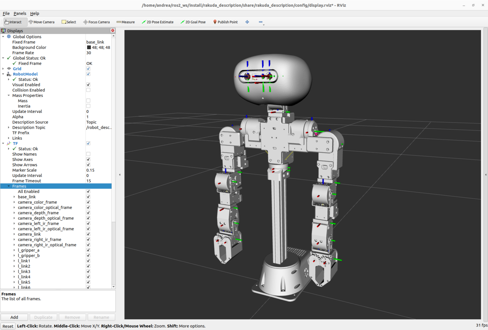

# rakuda_description

`rakuda_description` provides the full robot model and visualization assets for the **Rakuda** humanoid research platform.  
It contains the URDF/Xacro definitions, kinematic tree, inertial parameters and meshes needed to load the robot in ROS 2 tools such as `robot_state_publisher`, `joint_state_publisher(_gui)`, RViz2 and simulation environments.

The package is designed as the single source of truth for the mechanical structure of Rakuda, supporting dual 7-DOF arms, torso, head and sensor mounts, and is meant to be reused by control, perception and simulation packages across the project.



---

## Features

- Full URDF/Xacro model for the Rakuda humanoid research platform
- Dual 7-DOF arm kinematic chains with torso, neck and head links
- Integrated depth camera (Orbbec Gemini 335/336) mounted on the head
- Visual meshes for RViz2 and simplified collision meshes for simulation
- Ready-to-use launch file for `robot_state_publisher` + RViz2
- Configurable as a shared description package for other Rakuda ROS 2 stacks

---

## Dependencies

This package assumes a working ROS 2 environment (e.g. Humble or later) with the usual desktop tools installed.

Runtime dependencies include:

- `xacro`
- `robot_state_publisher`
- `joint_state_publisher` and/or `joint_state_publisher_gui`
- `rviz2`
- `OrbbecSDK_ROS2` (for the Gemini 335/336 depth camera description)

Make sure `OrbbecSDK_ROS2` is built and sourced in the same workspace, or available in your ROS 2 environment.

---

## Package layout

- `urdf/`
  - Main robot description (`rakuda.xacro`) and included component files
  - Materials, ROS 2 control and Gazebo extensions
- `meshes/`
  - `visual/` – high-resolution STL meshes used for visualization
  - `collision/` – simplified meshes used for collision checking and physics
- `launch/`
  - `display.launch.py` – convenience launch file to visualize the model in RViz2
- `config/`
  - `display.rviz` – RViz2 configuration preloaded with the Rakuda model
- `rakuda_description/`
  - Python package scaffold for `ament_python`

---

## Install & build

Clone the repository into your ROS 2 workspace:

```bash
cd ~/ros2_ws/src
git clone https://github.com/andreagavazzi/rakuda_description.git
```

Build the package:

```bash
cd ~/ros2_ws
colcon build --packages-select rakuda_description
```

Source the workspace:

```bash
source install/setup.bash
```

---

## Usage

To visualize Rakuda in RViz2:

```bash
ros2 launch rakuda_description display.launch.py
```

This will start:

- `robot_state_publisher` with the full Rakuda URDF
- `joint_state_publisher_gui` (by default) to interactively move joints
- `rviz2` with the preconfigured `display.rviz` layout

You can disable the GUI joint state publisher by passing:

```bash
ros2 launch rakuda_description display.launch.py gui:=false
```

---

## Roadmap

Ongoing and planned improvements:

- [x] Refine **mass values** from the latest CAD models
- [x] Improve **inertial tensors** based on accurate CAD exports
- [x] Replace temporary shapes with optimized **collision meshes**
- [ ] Add additional sensor options and mounting configurations
- [ ] Provide example simulation setups (Gazebo / other simulators)

---

## About

ROS 2 package with URDF/Xacro description of the Rakuda humanoid research platform.

---

## License

This project is licensed under the [Apache-2.0](LICENSE) license.